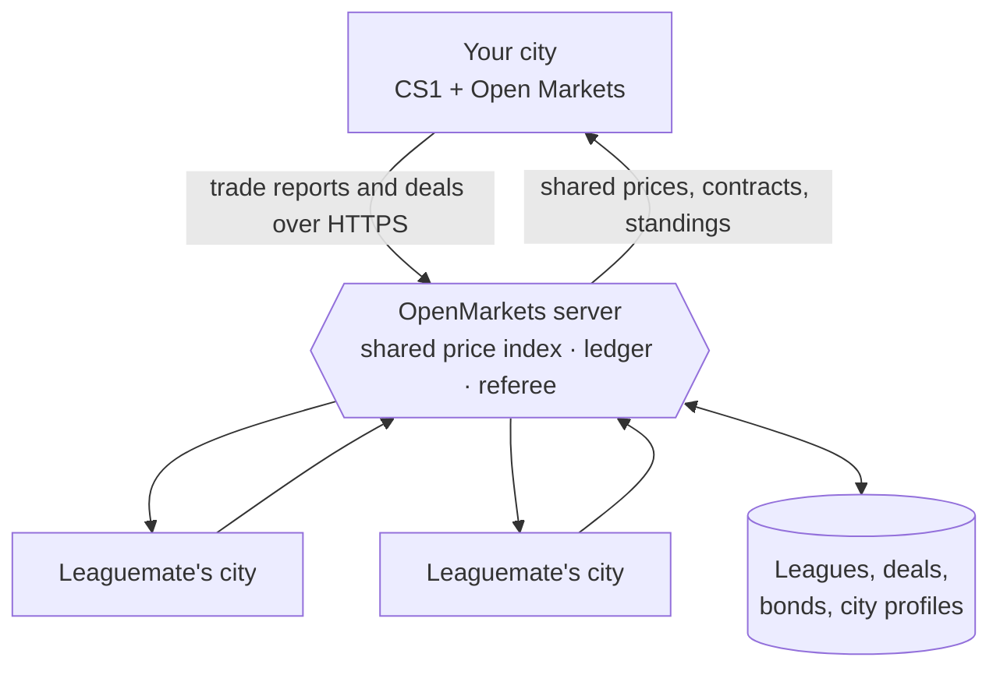

# Open Markets

A trade-economy mod for **Cities: Skylines 1** (the original, not CS2).

Vanilla treats the outside world as invisible tax: trucks and trains roll in and out, and all you see is a number. Open Markets replaces that with an actual commodity market. Every import and export earns real per-commodity money. Play alone and prices sit at stable base values. Play with friends and you share one live market, where dumping exports pushes a price down for everyone and the occasional global shock sends it swinging.


## What it does

Solo, it's quiet. Your outside-connection trade earns real per-commodity income at fixed prices, and a Markets board shows what each commodity is worth right now. Nothing to place, nothing to unlock.

The mod really comes alive online, where a **league** of friends shares one economy: the same market, the same prices, the same events. What your leaguemates do reaches your city.

## Features

**The market**
- Every import/export (truck, train, ship, or plane) books real per-commodity income instead of faceless tax.
- In a league, each commodity has one **shared price index** that your trade moves: net exports push it down for everyone, hoarding lifts it. It's **server-owned and clamped** (about 0.5×–2× base), so it tracks real supply and nobody can spike it at will.
- The server periodically fires **league-wide price events** (spikes and slumps over several in-game days), so there are good and bad windows to sell.

**Leagues & co-op**
- **Trade deals** — one-off or recurring **contracts** and multi-item **baskets** at frozen, index-priced terms; every offer shows its total value before you agree.
- **Influence RCI demand** — the **invest** lever spends § to give a leaguemate a targeted boost to a demand channel you choose (Residential, Commercial, or Industry & Office, plus attractiveness). The § transfers to them, so it's a real decision, not free money.
- **Great Works** — leagues cooperate on shared megaprojects; finishing one grants lasting bonuses, like an export price edge.
- **Shared city metrics** — the members panel shows each leaguemate's population, popularity, industry mix, finances, and online / last-seen status, so you can see who's booming and who to trade with (or prop up).
- **Bonds, loans & bailouts** — a missed installment becomes a **bond** instead of just failing; negotiate peer loans, or pay down a friend's debt to rescue them.
- **Austerity** — a city that defaults gets garnished and locked down (tax, budget, and demand) on the server's **real-time clock**, so quitting or reloading won't dodge it.

**Fair play**
- The **server is the referee** — pricing, settlement, and every timer live server-side, so a modified client can't fake prices or conjure income.
- **Money is conserved and audited** — each league's balances must net to zero, so no exploit quietly mints §.
- **Rate limits** on every endpoint plus a stricter cap on account creation; token auth over HTTPS.
- **Failure is only reputational** — an unsettled or defaulted deal never blocks a save from loading. Worst case is austerity and a dented standing, never a broken city.

**Also**
- **Real delivery (Industries DLC)** — trades that move physical goods actually ship into `[trade]`-tagged warehouses, not just settle cash.
- **Safe to try** — save- and removal-safe, additive Harmony patch, coexists with TM:PE and MoreEffectiveTransfer. Offline there's zero network activity.

## How online play works

Everyone runs their own game locally. The server is a shared referee and ledger, never a simulator, and solo play skips it entirely.



## Install

**Steam Workshop:** subscribe and it pulls in Harmony for you. *(Link goes here once it's published.)*

**Manual:** download the latest [release](../../releases), drop `OpenMarkets.dll` and `CitiesHarmony.API.dll` into your mods folder, then enable it in Content Manager → Mods.

- Windows: `%LOCALAPPDATA%\Colossal Order\Cities_Skylines\Addons\Mods\OpenMarkets\`
- macOS: `~/Library/Application Support/Colossal Order/Cities_Skylines/Addons/Mods/OpenMarkets/`
- Linux: `~/.local/share/Colossal Order/Cities_Skylines/Addons/Mods/OpenMarkets/`

You'll need the [Harmony](https://steamcommunity.com/sharedfiles/filedetails/?id=2040656402) mod (the game offers to grab it automatically). The Industries DLC is optional.

## Playing with friends

The online side talks to a small server, and you have two options.

**Use the public one.** The mod already points at a free community server (`cstrading.udonitus.com`), so there's nothing to configure. Open Options → Open Markets, create an account, and create or join a league with a friend's code. It's best-effort, with no uptime promises.

**Or run your own.** The backend is a small Go service with no database to set up, so it's one Docker command:

```bash
cd server
docker compose up --build      # serves on :8080
```

Then point everyone's **Options → Open Markets → Server base URL** at your host. For anything internet-facing, put it behind a reverse proxy or a Cloudflare Tunnel so it gets TLS. The full walkthrough is in [`docs/RUNNING-THE-SERVER.md`](docs/RUNNING-THE-SERVER.md).

## Building it

You need a modern .NET SDK. No Windows or Mono install required; the net35 target is handled through NuGet.

```bash
dotnet build OpenMarkets.sln -c Debug
```

The one thing the build can't provide is four copyrighted game DLLs (`ICities`, `ColossalManaged`, `Assembly-CSharp`, `UnityEngine`). If Cities: Skylines is installed, `Directory.Build.props` finds them automatically; otherwise copy them somewhere and set `ManagedDir` (see `Directory.Build.props.user.example`). It builds on Windows, macOS, and Linux. More detail in [`CONTRIBUTING.md`](./CONTRIBUTING.md).

## Compatibility

The money hook is an additive Harmony patch and goods delivery uses public game APIs, so it's built to coexist with transfer and cargo mods like TM:PE and MoreEffectiveTransfer. If you hit a conflict, please [open an issue](../../issues).

## Credits and license

Built on the work of the CS1 modding community: [CitiesHarmony](https://github.com/boformer/CitiesHarmony), [MoreEffectiveTransfer](https://github.com/pcfantasy/MoreEffectiveTransfer), [EnhancedOutsideConnectionsView](https://github.com/rcav8tr/CS1Mod-EnhancedOutsideConnectionsView), and [AdvancedOutsideConnection](https://github.com/DNKpp/CitiesSkylines_AdvancedOutsideConnection).

Released under the [MIT](./LICENSE) license.
