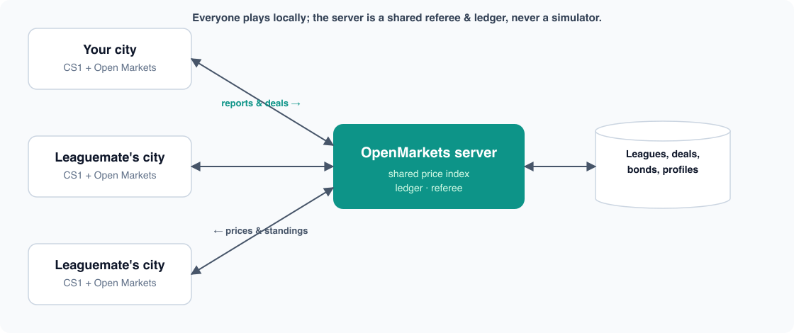
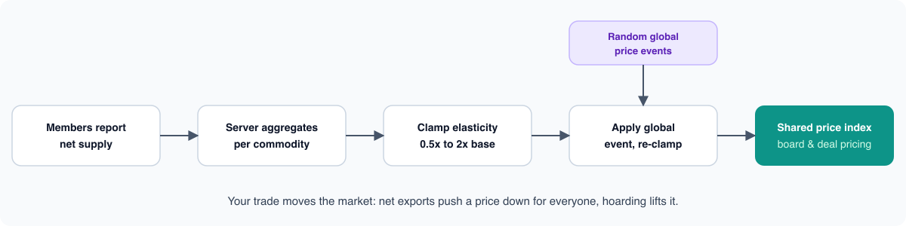

# Open Markets

A trade-economy mod for **Cities: Skylines 1** (the original, not CS2).

Vanilla treats the outside world as invisible tax: trucks and trains roll in and out, and all you see is a number. Open Markets replaces that with an actual commodity market. Every import and export earns real per-commodity money. Play alone and prices sit at stable base values. Play with friends and you share one live market, where dumping exports pushes a price down for everyone and the occasional global shock sends it swinging.

The idea is borrowed from *SimCity* (2013) and its online multiplayer regions — the thing that made that game special was that your city was never a private island. You and your friends built neighbouring cities that specialised, traded resources back and forth, and pooled effort into shared Great Works, and it genuinely stung when those servers were retired. Open Markets brings that spirit to Cities: Skylines 1, which otherwise only ever plays solo on your own map. You join a **league** of friends who share one economy and cooperate on projects, while seeing how you stack up against everyone else on a global board. The point isn't to build alone — it's to build *together* with your friends and *against* other leagues, and to have your neighbours' decisions actually reach your city.


> **Quickstart:** install it (subscribe on the Workshop, or drop the two DLLs in your mods folder) and enable it in Content Manager → Mods. Open the Markets board and you're trading. For the living market, go to Options → Open Markets, create an account, and share a league code with friends — the public server is already the default.

## Contents

- [What it does](#what-it-does)
- [Features](#features)
- [How online play works](#how-online-play-works)
- [Solo vs online](#solo-vs-online)
- [Install](#install)
- [Playing with friends](#playing-with-friends)
- [Connecting to a server: safety and trust](#connecting-to-a-server-safety-and-trust)
- [Building it](#building-it)
- [Compatibility](#compatibility)
- [FAQ](#faq)
- [How this was built](#how-this-was-built)
- [Credits and license](#credits-and-license)

## What it does

Solo, it's quiet. Your outside-connection trade earns real per-commodity income at fixed prices, and a Markets board shows what each commodity is worth right now. Nothing to place, nothing to unlock.

The mod really comes alive online, where a **league** of friends shares one economy: the same market, the same prices, the same events. What your leaguemates do reaches your city.

## Features

**The market**
- Every import/export (truck, train, ship, or plane) books real per-commodity income instead of faceless tax.
- In a league, each commodity has one **shared price index** that your trade moves: net exports push it down for everyone, hoarding lifts it. It's **server-owned and clamped** (about 0.5×–2× base), so it tracks real supply and nobody can spike it at will.
- The server periodically fires **league-wide price events** (spikes and slumps over several in-game days), so there are good and bad windows to sell.

**Leagues & co-op**
- **Trade deals** — one-off or recurring **contracts** and multi-item **baskets** at frozen, index-priced terms; every offer shows its total value before you agree.
- **Influence RCI demand** — the **invest** lever spends § to give a leaguemate a targeted boost to a demand channel you choose (Residential, Commercial, or Industry & Office, plus attractiveness). The § transfers to them, so it's a real decision, not free money.
- **Great Works** — leagues cooperate on shared megaprojects; finishing one grants lasting bonuses, like an export price edge.
- **Shared city metrics** — the members panel shows each leaguemate's population, popularity, industry mix, finances, and online / last-seen status, so you can see who's booming and who to trade with (or prop up).
- **Bonds, loans & bailouts** — a missed installment becomes a **bond** instead of just failing; negotiate peer loans, or pay down a friend's debt to rescue them.
- **Austerity** — a city that defaults gets garnished and locked down (tax, budget, and demand) on the server's **real-time clock**, so quitting or reloading won't dodge it.

**Fair play**
- The **server is the referee** — pricing, settlement, and every timer live server-side, so a modified client can't fake prices or conjure income.
- **Money is conserved and audited** — each league's balances must net to zero, so no exploit quietly mints §.
- **Rate limits** on every endpoint plus a stricter cap on account creation; token auth over HTTPS.
- **Failure is only reputational** — an unsettled or defaulted deal never blocks a save from loading. Worst case is austerity and a dented standing, never a broken city.

**Also**
- **Real delivery (Industries DLC)** — trades that move physical goods actually ship into `[trade]`-tagged warehouses, not just settle cash.
- **Safe to try** — save- and removal-safe, additive Harmony patch, coexists with TM:PE and MoreEffectiveTransfer. Offline there's zero network activity.

## How online play works

Everyone runs their own game locally. The server is a shared referee and ledger, never a simulator, and solo play skips it entirely.



### How prices move

Your trade is what moves the market. Each member reports their net supply; the server aggregates it per commodity, clamps how far it can swing, layers on any active global event, and feeds the same price back to everyone.



## Solo vs online

| | Solo | In a league |
|---|---|---|
| Per-commodity trade income | Yes | Yes |
| Markets board | Yes — stable base prices | Yes — live, moving prices |
| Prices move with your trade | — | Yes |
| Global price events | — | Yes |
| Contracts & baskets | — | Yes |
| Bonds, loans & austerity | — | Yes |
| Invest / bailout / Great Works | — | Yes |
| Needs a server | No | Yes — public by default, or self-host |
| Network activity | None | HTTPS to your league server |

## Install

**Steam Workshop ([subscribe here](https://steamcommunity.com/sharedfiles/filedetails/?id=3766546660)):** it pulls in Harmony automatically.

**Manual:** download the latest [release](../../releases), drop `OpenMarkets.dll` and `CitiesHarmony.API.dll` into your mods folder, then enable it in Content Manager → Mods.

- Windows: `%LOCALAPPDATA%\Colossal Order\Cities_Skylines\Addons\Mods\OpenMarkets\`
- macOS: `~/Library/Application Support/Colossal Order/Cities_Skylines/Addons/Mods/OpenMarkets/`
- Linux: `~/.local/share/Colossal Order/Cities_Skylines/Addons/Mods/OpenMarkets/`

You'll need the [Harmony](https://steamcommunity.com/sharedfiles/filedetails/?id=2040656402) mod (the game offers to grab it automatically). The Industries DLC is optional.

## Playing with friends

The online side talks to a small server, and you have two options.

**Use the public one.** The mod already points at a free community server (`cstrading.udonitus.com`), so there's nothing to configure. Open Options → Open Markets, create an account, and create or join a league with a friend's code. It's best-effort, with no uptime promises.

**Or run your own.** The backend is a small Go service with no database to set up, so it's one Docker command:

```bash
cd server
docker compose up --build      # serves on :8080
```

Then point everyone's **Options → Open Markets → Server base URL** at your host. For anything internet-facing, put it behind a reverse proxy or a Cloudflare Tunnel so it gets TLS. The full walkthrough is in [`docs/RUNNING-THE-SERVER.md`](docs/RUNNING-THE-SERVER.md).

## Connecting to a server: safety and trust

The online layer works by trusting a server you choose. Solo play contacts nothing. But once you point the mod at a server and make an account, **that server is fully authoritative over your online economy** — the mod reports to it and applies whatever it sends back. That's exactly what you want from the public server or one a friend runs, but it's worth understanding what connecting to an *untrusted* server actually means. Here's the honest version.

First, the reassuring part: this is a game mod that only speaks JSON over HTTP(S) and adjusts in-game economy state. **A malicious server cannot run code on your computer, read or write your files, or corrupt your save.** Everything it can do stays inside the game, and all of it is reversible.

**What a hostile or buggy server *can* do — all in-game, all reversible:**
- **Mess with your money.** The client trusts the server's prices and settlement log and doesn't clamp them, so a bad server can inflate or crater commodity prices, or post bogus settlements that add or drain § from your treasury.
- **Lock your city down.** It can hold your city in *austerity* — 29% taxes, capped service budgets, reduced RCI demand — for as long as you stay connected.
- **Nudge your trade depots.** On trade deliveries it can move stock in and out of your `[trade]`-tagged warehouses.
- **See your data.** By design the server, and everyone in your league, sees your shared city profile: population, finances, happiness, industry mix, your city name, and your display name. Whoever runs the server sees all of it, for every member.

**What it cannot do:** run code, touch your filesystem, corrupt or lock your save, or leave anything behind once you remove the mod. Go offline or disable the mod and every effect above is undone. (The one non-economy risk is a crash — a deliberately malformed response could crash the game — which is a nuisance, not a compromise.)

**Your account credential is per install, not per server.** Your account id and secret are stored once, and the mod sends them to whatever endpoint is set. If you created an account on one server and later connect to another, the second server receives that same secret and could replay it against the first. **So use a separate account for each server you don't fully trust** — don't reuse your public-server account on someone's random server.

**Use HTTPS.** The default endpoint is HTTPS and TLS certificates are properly checked. But a bare `host:port` is treated as plain `http://`, which sends your token in the clear — always enter an `https://` URL for anything crossing the internet.

**The two dashboards, and who sees what:**
- **The server's operator console** (`/console`) is a web page the *server* serves for whoever runs it. It's just a convenient UI over the same API — the operator already has full authority over the shared economy and every member's data simply by running the server, with or without the console. Operators can turn it off (`OM_CONSOLE=0`) or put it behind a token; the public server keeps it off.
- **The in-game terminal** (the Markets board, contracts, and Members panel inside CS1) is on *your* side. It shows you your league's shared data, including leaguemates' city profiles, which they've likewise chosen to share. It only displays what the server sends and exposes nothing extra about your machine.
- **Check the books yourself.** The API's `/audit` endpoint reports whether a league's balances net to zero. A non-zero total means the server is minting or burning money — a red flag you can verify without trusting the operator's word.

**Bottom line.** Treat a league server like any game host: join ones run by people you trust, or **host your own** — it's one Docker command (see [Playing with friends](#playing-with-friends)). If you do connect somewhere unfamiliar, use a throwaway account and an `https://` URL, and remember the worst case is in-game griefing you can undo by disconnecting, never harm to your computer or your save.

## Building it

You need a modern .NET SDK. No Windows or Mono install required; the net35 target is handled through NuGet.

```bash
dotnet build OpenMarkets.sln -c Debug
```

The one thing the build can't provide is four copyrighted game DLLs (`ICities`, `ColossalManaged`, `Assembly-CSharp`, `UnityEngine`). If Cities: Skylines is installed, `Directory.Build.props` finds them automatically; otherwise copy them somewhere and set `ManagedDir` (see `Directory.Build.props.user.example`). It builds on Windows, macOS, and Linux. More detail in [`CONTRIBUTING.md`](./CONTRIBUTING.md).

## Compatibility

The money hook is an additive Harmony patch and goods delivery uses public game APIs, so it's built to coexist with transfer and cargo mods like TM:PE and MoreEffectiveTransfer. If you hit a conflict, please [open an issue](../../issues).

## FAQ

**Do I need a server?** Not for solo play. For a league you do, but the free public server is the default, or you can self-host in one Docker command.

**Is my save safe?** Yes. Everything is stored in the mod's own save section, and removing the mod leaves your city loading normally.

**Does it work with other mods?** It's an additive Harmony patch and uses public game APIs, so it's built to coexist with mods like TM:PE and MoreEffectiveTransfer. If something conflicts, open an issue.

**Can someone cheat the market?** There's no easy way. Pricing and settlement happen server-side and are clamped, and every league's money is conserved and audited, so a modified client can't fake prices or mint §.

**What if the server goes down?** Everything falls back to solo (stable prices) and your saves keep loading. The online layer is best-effort and never required.

**Does it work with Cities: Skylines II?** No, this is CS1 only.

**Do I need any DLC?** No. The Industries DLC only adds physical-goods delivery into `[trade]` warehouses; everything else works without it.

## How this was built

Full disclosure: Open Markets was built with heavy use of AI coding tools — mainly [Claude Code](https://www.anthropic.com/claude-code) and Codex. They generated and reviewed a large share of the mod code, the Go backend, the deployment setup, and the documentation (including this README), under human direction, testing, and design decisions throughout. Noting it here for transparency.

## Credits and license

Built on the work of the CS1 modding community: [CitiesHarmony](https://github.com/boformer/CitiesHarmony), [MoreEffectiveTransfer](https://github.com/pcfantasy/MoreEffectiveTransfer), [EnhancedOutsideConnectionsView](https://github.com/rcav8tr/CS1Mod-EnhancedOutsideConnectionsView), and [AdvancedOutsideConnection](https://github.com/DNKpp/CitiesSkylines_AdvancedOutsideConnection).

Released under the [MIT](./LICENSE) license.
