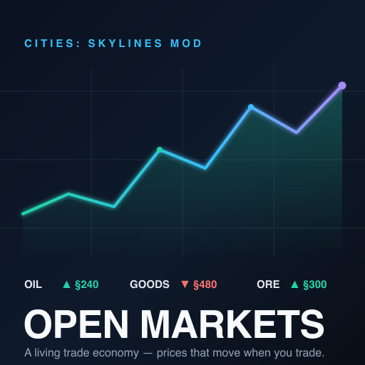

# Open Markets

A trade-economy mod for **Cities: Skylines 1** (the original, not CS2).

Vanilla treats the outside world as invisible tax: trucks and trains roll in and out, and all you see is a number. Open Markets replaces that with an actual commodity market. Every import and export earns real per-commodity money. Play alone and prices sit at stable base values. Play with friends and you share one live market, where dumping exports pushes a price down for everyone and the occasional global shock sends it swinging.



## What it does

Solo, it's quiet. Your outside-connection trade earns real per-commodity income at fixed prices, and a Markets board shows what each commodity is worth right now. Nothing to place, nothing to unlock.

Go online (optional) and a league of friends shares one price index per commodity. Net exports drag a price down, hoarding lifts it, and random global events hit the whole league at once, so there are good days and bad days to sell. Online also adds:

- Peer contracts and multi-item baskets at locked-in prices
- Bonds and loans for when someone can't pay
- Austerity for cities that default: garnished and locked down on a real-time clock, so quitting the game won't get you out of it
- Co-op levers to invest in a friend's economy or bail them out of austerity
- A members panel with everyone's city stats and standing

With the Industries DLC, trades that move physical goods actually deliver into `[trade]`-tagged warehouses instead of only settling cash.

It's safe to try. Everything is stored in the mod's own save section, so removing the mod leaves your city loading normally, and offline there's no network activity at all.

## Install

**Steam Workshop:** subscribe and it pulls in Harmony for you. *(Link goes here once it's published.)*

**Manual:** download the latest [release](../../releases), drop `OpenMarkets.dll` and `CitiesHarmony.API.dll` into your mods folder, then enable it in Content Manager → Mods.

- Windows: `%LOCALAPPDATA%\Colossal Order\Cities_Skylines\Addons\Mods\OpenMarkets\`
- macOS: `~/Library/Application Support/Colossal Order/Cities_Skylines/Addons/Mods/OpenMarkets/`
- Linux: `~/.local/share/Colossal Order/Cities_Skylines/Addons/Mods/OpenMarkets/`

You'll need the [Harmony](https://steamcommunity.com/sharedfiles/filedetails/?id=2040656402) mod (the game offers to grab it automatically). The Industries DLC is optional.

## Playing with friends

The online side talks to a small server, and you have two options.

**Use the public one.** The mod already points at a free community server (`cstrading.udonitus.com`), so there's nothing to configure. Open Options → Open Markets, create an account, and create or join a league with a friend's code. It's best-effort, with no uptime promises.

**Or run your own.** The backend is a small Go service with no database to set up, so it's one Docker command:

```bash
cd server
docker compose up --build      # serves on :8080
```

Then point everyone's **Options → Open Markets → Server base URL** at your host. For anything internet-facing, put it behind a reverse proxy or a Cloudflare Tunnel so it gets TLS. The full walkthrough is in [`docs/RUNNING-THE-SERVER.md`](docs/RUNNING-THE-SERVER.md).

## Building it

You need a modern .NET SDK. No Windows or Mono install required; the net35 target is handled through NuGet.

```bash
dotnet build OpenMarkets.sln -c Debug
```

The one thing the build can't provide is four copyrighted game DLLs (`ICities`, `ColossalManaged`, `Assembly-CSharp`, `UnityEngine`). If Cities: Skylines is installed, `Directory.Build.props` finds them automatically; otherwise copy them somewhere and set `ManagedDir` (see `Directory.Build.props.user.example`). It builds on Windows, macOS, and Linux. More detail in [`CONTRIBUTING.md`](./CONTRIBUTING.md).

## Compatibility

The money hook is an additive Harmony patch and goods delivery uses public game APIs, so it's built to coexist with transfer and cargo mods like TM:PE and MoreEffectiveTransfer. If you hit a conflict, please [open an issue](../../issues).

## Credits and license

Built on the work of the CS1 modding community: [CitiesHarmony](https://github.com/boformer/CitiesHarmony), [MoreEffectiveTransfer](https://github.com/pcfantasy/MoreEffectiveTransfer), [EnhancedOutsideConnectionsView](https://github.com/rcav8tr/CS1Mod-EnhancedOutsideConnectionsView), and [AdvancedOutsideConnection](https://github.com/DNKpp/CitiesSkylines_AdvancedOutsideConnection).

Released under the [MIT](./LICENSE) license.
