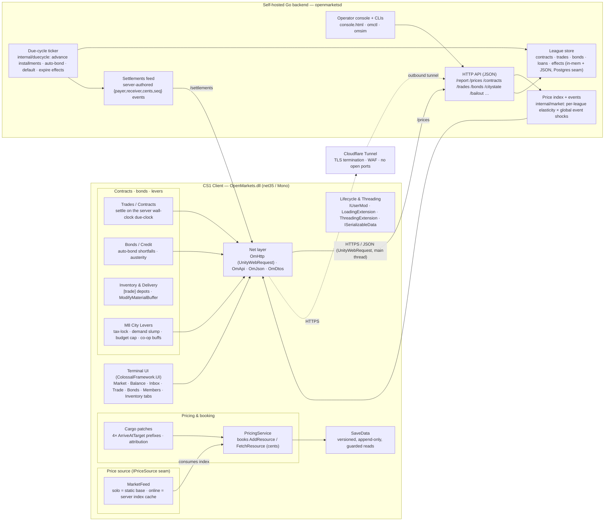
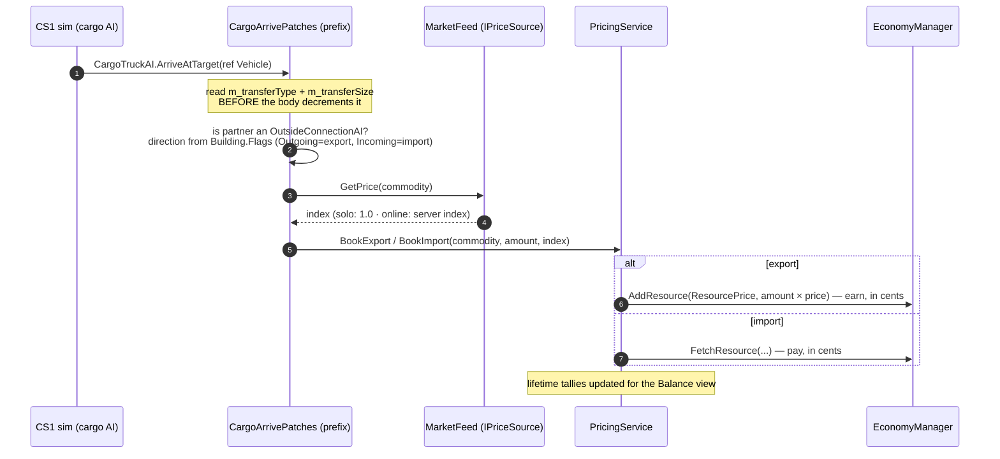
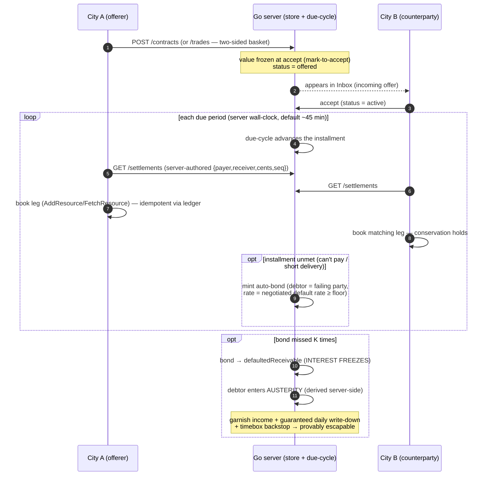
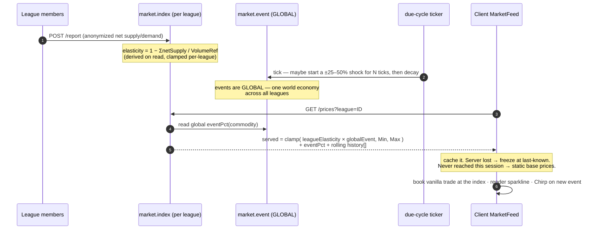

# Open Markets — How It Works / Architecture

> A developer/modder orientation to the whole system. If you're landing here from GitHub and want to
> understand *what this mod is and how its pieces fit together*, start at the top and read down.
>
> This document describes the **current, shipped architecture** as captured in the design docs
> (`DESIGN.md`, `BACKEND.md`, this file). The single-index market rework is **complete and shipped**, so the
> diagrams here match the code (allowing for the usual prose-vs-source abstraction).

---

## 1. What it is

**Open Markets is a code mod for Cities: Skylines 1** (the original — *not* CS2) that turns the game's
anonymous outside-world import/export into a **living commodity market**, plus an *optional* online
"play with friends" league economy.

- **The mod half** is a `net35` / Mono C# assembly (Unity 5.6.6f2 ABI) that hooks the game with
  **Harmony** patches and renders its UI with **ColossalFramework.UI**. It books trade money itself when
  cargo touches an outside connection, prices it against a market index, and surfaces everything through
  an in-game tabbed **terminal**.
- **The server half** is a small, **self-hosted Go backend** (stdlib-only, single static binary) that runs
  the *league economy*: a shared price index, peer **trade contracts**, a **bonds / credit** layer,
  **austerity** for insolvent cities, and **city levers** (demand / tax / budget effects plus co-op
  investment and bailout). It is a **referee + ledger + bulletin board**, never a simulator — every client
  runs the full game locally and polls over HTTPS.

Crucially, **solo play is server-free**. Offline, every commodity simply trades at its static base price.
The market *comes alive* (elasticity + price-swing events + peer trading) only when you connect to a league
server. That keeps the mod Workshop-friendly for everyone and makes "the living economy" the multiplayer hook.

### Platform constraints that shape everything

These are non-negotiable and explain many design choices below:

| Constraint | Consequence |
|---|---|
| **Target `net35` (Mono / Unity 5.6)** | No `async`/`await`, no `record`/`init`, no value-tuples without polyfills. LINQ + string interpolation OK. |
| **Mono can't negotiate TLS 1.2** | All networking goes through **`UnityWebRequest`** (OS TLS stack) on the **main thread** — not `HttpWebRequest`. No WebSockets; REST polling only. |
| **Thread split** | `TransferManager`/`EconomyManager`/sim data → **simulation thread**; Unity & UI objects → **main thread**. Cross with `QueueSimulationThread` / `QueueMainThread`. |
| **Harmony, additively** | Prefer Prefix/Postfix over transpilers; keep HarmonyLib out of `IUserMod`; make patch/unpatch idempotent. |
| **Save-safety (NFR-3)** | Persist only under our own versioned data id; **mod removal must leave the save loadable.** Never bake custom structures into vanilla save data. |
| **Client is untrusted** | Single-player, fully moddable, no server-authoritative sim. Anti-cheat = server-side plausibility + aggregation + reputation, never enforcement. A cheater hurts only their own standing. |

---

## 2. High-level architecture

Two halves talk over **HTTP/JSON via `UnityWebRequest`**. The client is always functional on its own; the
server only *augments* it.



### Client subsystems (in `OpenMarkets/`)

- **Lifecycle & threading** — `Mod.cs` (`IUserMod`: settings + Harmony bootstrap), `Patcher.cs`
  (PatchAll/UnpatchAll, HarmonyLib isolated here), `ModLifecycle.cs` (level load/unload + the daily sim
  tick). Hooks re-fire on enable/disable/recompile, so every setup is reversible.
- **Price source** — `Market/IPriceSource.cs` is the seam. Under the M9 model, `Market/MarketFeed.cs` is the
  active source: **solo** returns static base prices (`index = 1.0`); **online** caches the server's
  per-commodity index (with `eventPct` + history) polled via `OnlineSync`. The pre-M9 local price generator is
  gone: `RemotePriceSource` and `SpeculationWatch` are **deleted**, and `LocalPriceSim` survives **only** as the
  net-supply report accumulator (it feeds `/report/batch`; it no longer produces prices).
- **Pricing & booking** — `Market/PricingService.cs` books export income (`EconomyManager.AddResource`) and
  import cost (`FetchResource`) in **cents** at the market index. `Patches/CargoArrivePatches.cs` holds the
  four `CargoTruckAI.ArriveAtTarget` prefixes (truck/train/ship/plane) that attribute
  `(commodity, amount, direction)`; `Patches/IndustryPricePatch.cs` neutralizes the Industries DLC
  `GetResourcePrice` to avoid double-counting.
- **Terminal UI** — `UI/Terminal/`: one draggable tabbed window (`MarketTerminal`) hosting `ITabBody`
  tabs — Market, Balance, plus online-gated Inbox, Trade/NewOffer, Contracts, Bonds, Members,
  LeagueBalance, Inventory — built on a shared `UiKit`. Main-thread only; reads sim data via snapshots.
- **Contracts / bonds / inventory** — `Market/` (ContractSettlement, ContractLedger, SettlementReconciler,
  SettlementLedger, BasketValuation, TradeMath, Money) settles peer deals idempotently off the real-time poll
  loop, paced to the server's wall-clock due period (learned via `/citystate`).
  `Trade/` (TradeDepots, InventoryService, InventoryReservations, TradeDelivery) grounds the *give* side in
  real `[trade]`-tagged warehouse stock and physically moves goods via `WarehouseAI.ModifyMaterialBuffer`.
- **M8 city levers** — `TaxLock.cs`, `BudgetLock.cs`, `DemandLever.cs`, `DeliveryStimulus.cs`,
  `CoopBuff.cs`, plus `Patches/TaxRatePatch.cs` & `Patches/BudgetRatePatch.cs`. All ride the `/citystate`
  poll; all are transient or stash/restore vanilla-persisted values (save-safe).
- **Net & persistence** — `Net/` (OmHttp on `UnityWebRequest`, OmApi typed calls, OmDtos, **OmJson** — a
  reflective reader that fixes a Unity `JsonUtility` bug with mixed scalar+array DTOs). `Persistence/SaveData.cs`
  is the single versioned blob (`ISerializableDataExtension`).

### Server subsystems (in `server/`)

- **Price index + events** — `internal/market/` computes `index = clamp(elasticity(reports) × event, Min, Max)`
  per commodity. Elasticity is **per-league** (from members' net-supply reports); price-swing **events** are
  **global** (one world-economy shock series). Served via `/prices` (with `eventPct` + a rolling history ring).
- **League store** — `internal/store/` holds contracts, trades, bonds, loans, and lever **effects** behind a
  `Store` interface (in-memory + JSON snapshot today; a Postgres swap-in is the documented seam).
- **Due-cycle ticker** — `internal/duecycle/` is the server-owned clock: it advances missed installments on
  due dates, auto-bonds shortfalls, drives bonds to default, garnishes during austerity, and expires
  timed lever effects — so an *offline* debtor still accrues consequences (offline does not pause debt).
- **Settlements feed** — server-authored `{payer, receiver, cents, seq, ack}` events both clients book
  idempotently, so cash is **conservation-safe** (no client can credit itself without the matching debit).
- **HTTP API + ops tooling** — `internal/api/` (JSON handlers + the `console.html` operator console, which
  doubles as a full co-op counterparty), plus `cmd/openmarketsd` (the daemon), `cmd/omctl` (operator CLI to
  hand-run a simulated city), and `cmd/omsim` (a seeded economy stress harness). Ingress is **Cloudflare
  Tunnel** (outbound-only, free valid TLS, no open ports).

---

## 3. Key flows

### (a) Vanilla import/export booking at the market index

When the game's own cargo logistics deliver to or from an outside connection, the mod attributes the trade
and books the money itself — at the current index, with no spread (M9).



### (b) Peer trade contract lifecycle (offer → accept → settle → bond on default → austerity)

A contract is a **bilateral, cash-settled** agreement over N installments. The server holds consent + the
ledger and owns the due schedule on a **wall-clock due-clock** (`OM_DUE_INTERVAL_SEC`, default ~45 min ≈ one
in-game day; `run-local.ps1` sets 120s for testing). The client learns the period via `/citystate` and
auto-settles its legs off its real-time poll loop (not the in-game-day rollover), so pausing or sim-speed
doesn't drift it out of step. Any unmet installment auto-converts to a **bond**; a bond that goes terminal
pushes the debtor into **austerity**. Misses/garnishment are server-driven (an offline city still accrues —
no "dodge by quitting").



### (c) The price model — per-league elasticity × global events → the index the client books at (M9)

The living market is **online-only and server-owned**. Per-league supply/demand drives elasticity; a global
shock series drives events; the product (clamped) is the index every member books at.



### (d) A city lever — austerity drives effects; co-op investment / bailout

Levers are the online economy reaching into core city simulation. **Self-consequence** levers are derived
from austerity and applied locally; **co-op** levers are explicitly issued by a leaguemate and conserve cash
via a symmetric transfer.

```mermaid
sequenceDiagram
    autonumber
    participant Srv as Go server (/citystate, effects)
    participant Sync as OnlineSync (client poll)
    participant Levers as TaxLock / BudgetLock / DemandLever
    participant Sim as CS1 simulation
    participant Friend as Leaguemate

    rect rgb(245,238,230)
    Note over Srv,Sim: Self-consequence (austerity-driven, inflicted on self)
    Sync->>Srv: GET /citystate
    Srv-->>Sync: { austerity: true, taxFloor, budgetCeil, … }
    Sync->>Levers: Sync(state)
    Levers->>Levers: stash player's prior tax/budget (versioned SaveData)
    Levers->>Sim: SetTaxRate forced 29% · SetBudget capped 75% · demand −40%
    Note over Levers,Sim: re-assert every tick (player can fight back);<br/>telegraphed on BondsTab banner + Chirp
    end

    rect rgb(232,242,236)
    Note over Friend,Sim: Co-op (issued by a friend, conserves cash)
    Friend->>Srv: POST /investment-office (symmetric §, days)
    Srv->>Srv: book issuer→grantee transfer (cash conserved)
    Sync->>Srv: GET /citystate (effects payload)
    Srv-->>Sync: { effects: [ +demand, +attractiveness, expiresDay ] }
    Sync->>Levers: CoopBuff.Apply (each sim tick, transient)
    Friend->>Srv: POST /bailout (pay down a defaulted bond)
    Srv->>Srv: distribute § across debtor's defaulted bonds → clear at zero
    Note over Srv,Sim: debtor's austerity lifts → tax-lock + budget-cap UNWIND
    end
```

> **Guardrails (mandatory for any inflicted effect):** time-box & auto-expire · recovery floor (never brick a
> city) · magnitude cap · cooldown / per-offline-period cap · symmetric cost to the attacker · telegraphed &
> attributed · reversible on mod removal / server death. The tax-lock is the proven template for all of them.

---

## 4. Design principles worth highlighting

- **Save-safety is sacred (NFR-3).** The mod persists only its own versioned, append-only, guarded blob via
  `ISerializableDataExtension`. Anything it forces into a vanilla-persisted structure (tax rate, service
  budget) is **stashed first and restored** on austerity-exit *and* on `OnDisabled`/mod-removal. Custom
  Chirper messages are stripped from the queue before the vanilla save is written. **Pull the mod and the
  city still loads cleanly, with the player back in control.** Online state (friends' profiles, contracts,
  effects) is *never* load-critical.

- **`net35` / Mono constraints drive the transport.** Mono can't do TLS 1.2, so every network call uses
  **`UnityWebRequest`** on the **main thread**, with results marshaled to the sim thread before touching
  `EconomyManager`. No `async`/`await`, no WebSockets — REST polling with exponential back-off and silent
  local fallback. A `TlsSmokeTest` gate proved this works in-game before any online logic was trusted.

- **Money conservation.** Cash never appears from nowhere. Peer settlements are **server-authored**
  `{payer, receiver, cents, seq}` events that *both* clients book idempotently; co-op levers transfer cash
  symmetrically (issuer→grantee); a manual bond's principal isn't credited until the lender's debit is acked.
  Integer cents + fixed-point quantities throughout; amortization sums to the exact total. A seeded sim
  harness (`internal/sim`) and money-math fuzzing assert conservation and austerity escapability.

- **Solo = server-free static prices; online = server index.** Offline play needs no server, no account, no
  network — every commodity sits at its base price. The dynamic market (elasticity + events + peer trading)
  is the *reward* for connecting to a league. This resolves the distribution risk (Workshop users never
  depend on a server) and makes "the market wakes up" the multiplayer hook.

- **Best-effort online, graceful degradation.** Every server call is best-effort: a timeout / 404 / 410-Gone
  is *normal*, not an error popup. The client freezes at the last-known index, or falls back to static base
  prices if the server was never reached. A server-published end-of-life flag lets old clients go local-only
  forever. The mod must outlive the service.

- **The client is untrusted by design.** No server-authoritative simulation is possible on CS1, so security
  is server-side **plausibility + aggregation + reputation**, never enforcement. Outliers are clamped and
  shadow-trimmed; a cheater only wrecks their own standing. This is acceptable precisely because the model is
  *play with friends*, not a public adversarial economy.

---

## 5. Repository layout

```
open-markets/
├── OpenMarkets/                  # net35 C# client (the mod → OpenMarkets.dll)
│   ├── Mod.cs · Patcher.cs       # IUserMod entry + Harmony bootstrap (HarmonyLib isolated)
│   ├── ModLifecycle.cs           # level load/unload + daily sim tick
│   ├── Data/                     # commodity table + partner model
│   ├── Market/                   # IPriceSource, MarketFeed, PricingService, contract settlement, Money
│   ├── Trade/                    # [trade] depots, inventory/reservations, delivery, controls
│   ├── Patches/                  # cargo-arrive, industry-price, message-serialize, tax/budget-rate
│   ├── UI/Terminal/              # tabbed terminal: Market, Balance, Inbox, Trade, Bonds, Members, …
│   ├── Net/                      # OmHttp (UnityWebRequest), OmApi, OmDtos, OmJson
│   ├── Persistence/SaveData.cs   # single versioned, append-only save blob
│   ├── {TaxLock,BudgetLock,DemandLever,DeliveryStimulus,CoopBuff}.cs   # M8 city levers
│   └── {OnlineSync,OnlineMode,LeagueRoster,MyLeagues,Settings}.cs
│
├── server/                       # self-hosted Go backend (the league economy → openmarketsd)
│   ├── cmd/                      # openmarketsd (daemon) · omctl (operator CLI) · omsim (stress sim)
│   └── internal/
│       ├── api/                  # JSON HTTP handlers + console.html operator console
│       ├── market/               # index (per-league elasticity) + event (global shocks)
│       ├── store/                # contracts, trades, bonds, loans, effects (in-mem + JSON; Postgres seam)
│       ├── duecycle/             # server-owned due clock (installments, defaults, effect expiry)
│       ├── pricing/ · money/     # base prices × index · cents amortization + fuzz tests
│       ├── sim/                  # seeded conservation/escapability harness
│       └── config/ · id/
│
└── docs/ + *.md (root)           # design docs: DESIGN.md, BACKEND.md, CHANGELOG.md, this ARCHITECTURE.md
```

**Where to start reading code:** the client's nerve center is `ModLifecycle.cs` (wires the price source, UI,
and tick) and `Market/PricingService.cs` (where money is booked). The server's nerve center is
`internal/api/` (the HTTP surface) over `internal/store/` (the league state) and `internal/duecycle/` (the
clock that makes obligations real). For *why* anything is the way it is, `DESIGN.md` (rationale) and
`BACKEND.md` (server design) are the source of truth, with `CHANGELOG.md` for project history.
